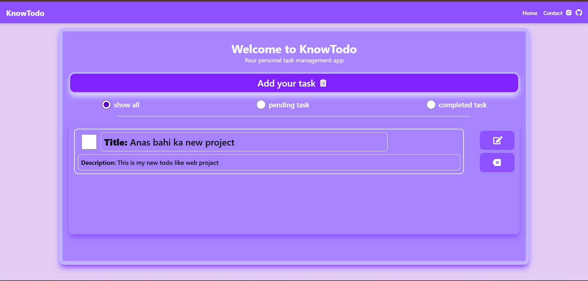
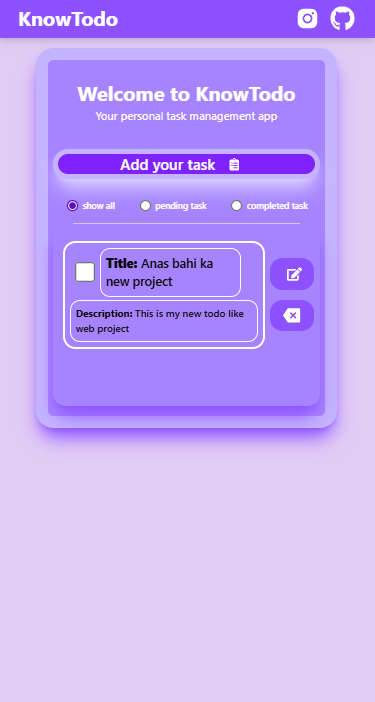

# 📝 react-todo - A Responsive Todo Web App

**react-todo** is a clean and fully responsive **Todo List Web App** built using **React**  and **Tailwind CSS** . It helps users add, edit, delete, filter, and manage their daily tasks with ease.

> Developed by [Anas](#developer) as part of my web development learning journey.

---

📍 **Live Site:** [react-todo Web App](https://asfnsa.github.io/react-todo/)

---

## 🚀 Features

- ✅ Add new tasks with title & description  
- ✅ Edit or delete existing tasks  
- ✅ Mark tasks as completed or pending  
- ✅ Filter tasks (All / Pending / Completed)  
- ✅ LocalStorage support – your data stays even after page refresh  
- ✅ Smooth popup modal for task input  
- ✅ Fully responsive for all screen sizes (Mobile, Tablet, Desktop)

---

## 🛠️ Tech Stack

| Tech | Description |
|------|-------------|
| **React.js** | Frontend library for component-based UI |
| **Tailwind CSS** | Utility-first CSS framework for styling |
| **JavaScript** | Core logic for task handling |
| **HTML5 & JSX** | For structure and layout |
| **LocalStorage** | For storing tasks persistently in browser |

---

## 🧠 Tools & Languages I Know

<p align="left">
  
  
  
  
  
  
  
</p>

---

## 📸 Screenshots

| Desktop View | Mobile View |
|--------------|-------------|
|  |  |

---

## 🔧 Installation

```bash
# Clone the repository
git clone https://github.com/asfnsa/react-todo.git

# Go to the project directory
cd react-todo

# Install dependencies
npm install

# Start the development server
npm run dev
